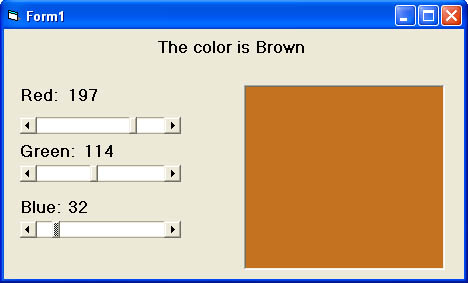



## Color Recognition Version 2

### Description

This snippet of code will change the background color of a picture box to reflect the value of the Red, Green and Blue scroll bars as well as indicate what the color it is. This an updated version from my previous code. This new code can now distinguish various colors like brown, tan, beige etc...
 
### More Info
 

             |
---                |---
**Submitted On**   |2004-06-19 22:04:48
**By**             |[Jennifer MacDonald](https://github.com/Planet-Source-Code/PSCIndex/blob/master/ByAuthor/jennifer-macdonald.md)
**Level**          |Intermediate
**User Rating**    |4.3 (34 globes from 8 users)
**Compatibility**  |VB 6\.0
**Category**       |[Graphics](https://github.com/Planet-Source-Code/PSCIndex/blob/master/ByCategory/graphics__1-46.md)
**World**          |[Visual Basic](https://github.com/Planet-Source-Code/PSCIndex/blob/master/ByWorld/visual-basic.md)
**Archive File**   |[Color\_Reco1759466202004\.zip](https://github.com/Planet-Source-Code/jennifer-macdonald-color-recognition-version-2__1-54488/archive/master.zip)

